# TERCER_PROYECTO: ANIMACION CON ADAPTER
## Autores: Luis Guillermo Velez - Johan Aguirre Diaz
### Situación problema:
Se necesita un catalogo de personajes en el que nuestros personajes tengan la posibilidad de realizar movivimientos en 2 direcciones(izquierda,derecha) y que se vea reflejado en pantalla; utilizando el patron adapter.

### Analisis del problema:
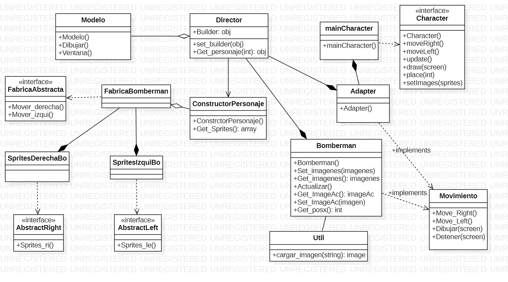
Para esta situación utilizaremos el patron abstract factory para guardar nuestro personaje bomberman ,y el patron adapter para añadir el segundo personaje caballero, que fue creado a partir de una interfaz diferente. 

### Requerimientos
* **Tener instalado python 3.**
* **Tener instalado  pygame.**

_Nota: si no se tiene instalado puede seguir el siguiente intructivo._ 

**Instalar python:**
1. Descargamos el instalador de python en [https://www.python.org/downloads/](https://www.python.org/downloads/).

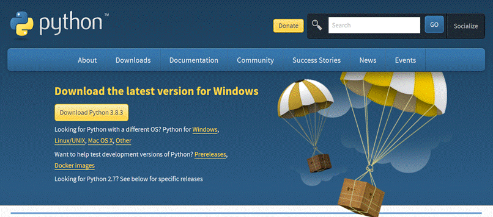

2. Ejecutar el instalador e instalar python:

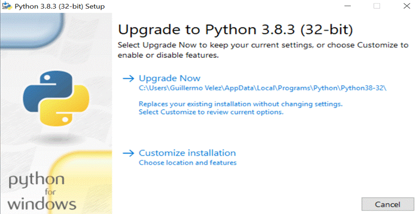

_Nota: Al instalar algunas versiones de python pueda que no venga con pip (paquete de instalacion para Python) asi la puede instalar._

**Instalar pip:**

1. Descargamos el archivo “get-pip.py”en: [https://pip.pypa.io/en/stable/installing/](https://pip.pypa.io/en/stable/installing/).

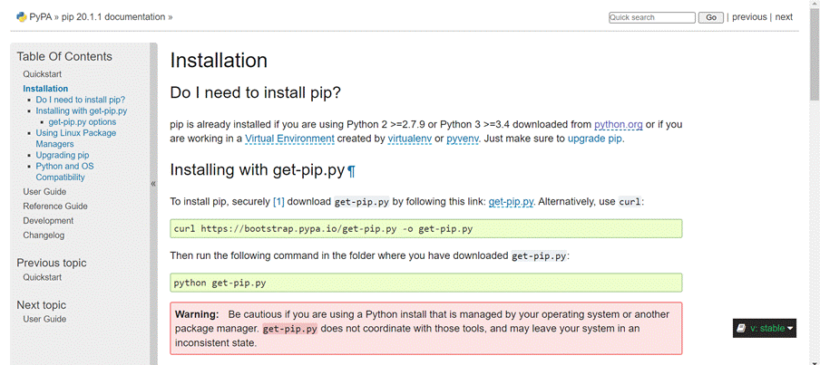

2. En la terminal de windows y en la ruta donde tengamos el archivo anteriormente descargado ejecutamos el siguiente comando

       python get-pip.py
     
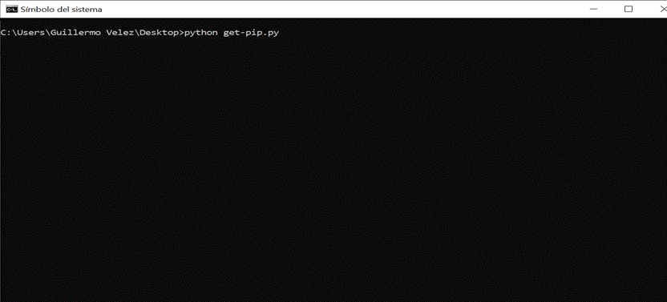

**Instalar pygame:**
En la terminal de windows ejecutamos el siguiente comando:

            pip install pygame
            
  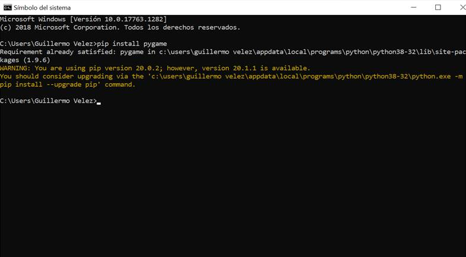
            

            
### Manual de usuario:
El programa tiene 2 personajes (bomberman, caballero):

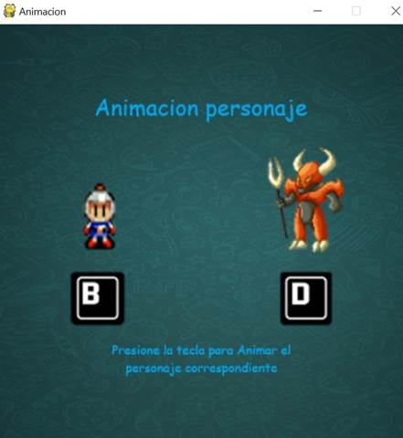

* **Bomberman.**
Para acceder a bomberman pulsamos la letra B en el teclado e ingresaremos a la animacion de bomberman, moveremos al personsaje con el boton izquierda y derecha

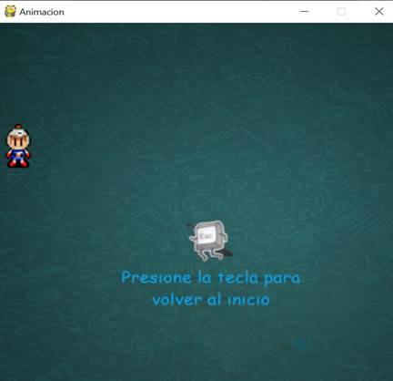

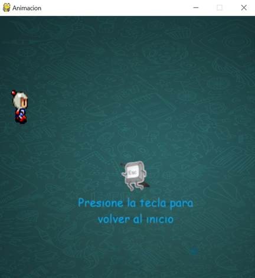

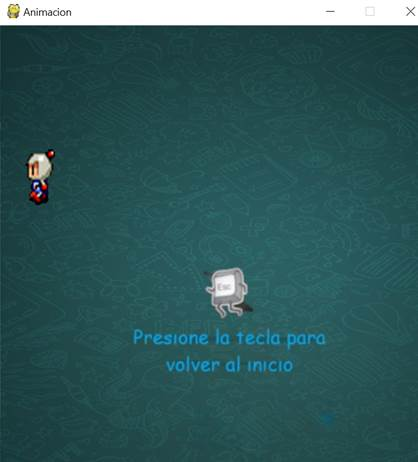

* **Preparar.**
Para acceder a caballero pulsamos la letra D en el teclado e ingresaremos a la animacion de caballero, moveremos al personsaje con el boton izquierda y derecha

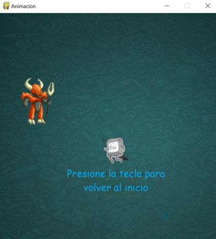

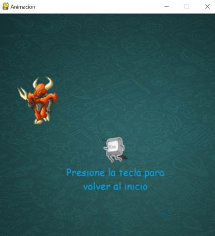

_Nota: Para salir de cualquier animacion y volver al menu de seleccion de personajes pulsaremos la tecla escape durante cualquiera de las 2 animaciones._
